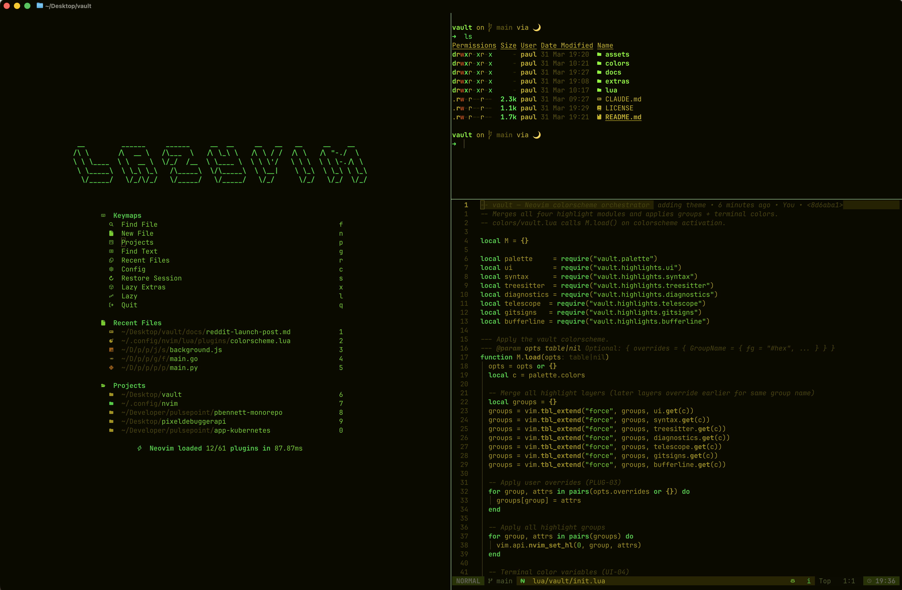

<h1 align="center">
    
</h1>

**vault** is a Neovim colorscheme (pure Lua plugin) inspired by the phosphor terminals of the Fallout universe and the iconic green cascade of The Matrix. It uses a warm amber phosphor base with Matrix green accents against a near-black background — dark, retro-futuristic, and built for programmers who live in the terminal.

**Core Value:** A colorscheme that feels like hacking from inside a Vault-Tec terminal — amber phosphor dominates, Matrix green punctuates, and every highlight group serves readability over decoration.

## Demo



## Install

```lua
{
  "mrpbennett/vault",
  priority = 1000,
  lazy = false,
  config = function()
    vim.cmd.colorscheme("vault")
  end,
}
```

## Palette

| Name    | Hex     | Role                            |
| ------- | ------- | ------------------------------- |
| bg      | #0a0a00 | Background                      |
| fg      | #c8b400 | Primary text (amber phosphor)   |
| green   | #00ff41 | Keywords, accent (Matrix green) |
| comment | #5a5200 | Comments                        |
| string  | #7aff00 | String literals                 |
| ui_bg   | #2a2800 | UI chrome, float windows        |
| error   | #cc4400 | Errors, git delete              |
| warning | #c87000 | Warnings                        |

## Customize

```lua
{

  lazy = false,
  config = function()
    require("vault").setup({
      overrides = {
        Comment = { fg = "#7a7000", italic = true },
      },
    })
    vim.cmd.colorscheme("vault")
  end,
}
```

## Ghostty

1. Copy `extras/ghostty/vault` to `~/.config/ghostty/themes/vault`
2. Add `theme = vault` to `~/.config/ghostty/config`
